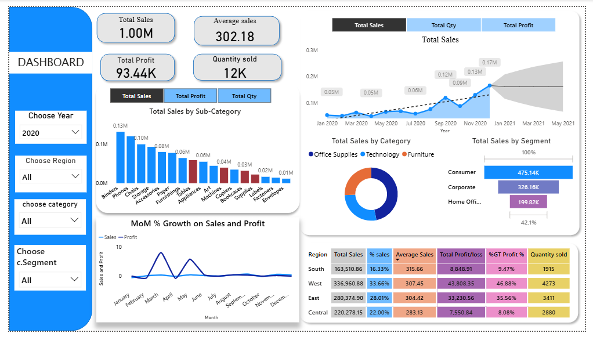

# 📊 Sales Dashboard – Power BI

This repository contains a **Power BI interactive dashboard** that provides a comprehensive analysis of sales performance, profit trends, and quantity sold across various categories, regions, and customer segments.

## 🔹 Dashboard Features
- **KPIs Overview**:  
  - Total Sales  
  - Average Sales  
  - Total Profit  
  - Quantity Sold  

- **Interactive Filters**:  
  - Year selection  
  - Region filter  
  - Category filter  
  - Segment filter  

- **Visual Insights**:  
  - **Total Sales by Sub-Category** – Bar chart  
  - **Total Sales Trend** – Line chart with forecast  
  - **Sales by Category** – Donut chart  
  - **Total Sales by Segment** – Bar chart  
  - **MoM % Growth** – Line chart for Sales & Profit  
  - **Regional Sales Table** – Detailed metrics with % contribution  

## 📈 Key Insights
- Technology and Office Supplies dominate sales performance.
- Strong growth observed in Q4 2020, with forecast indicating upward trends.
- The **West region** contributes the highest sales share (~33.66%).

## 🛠 Tools Used
- **Power BI** – Dashboard creation & visualization
- **DAX** – Calculations & measures
- **CSV Dataset** – Raw sales data

## 📂 Repository Structure
