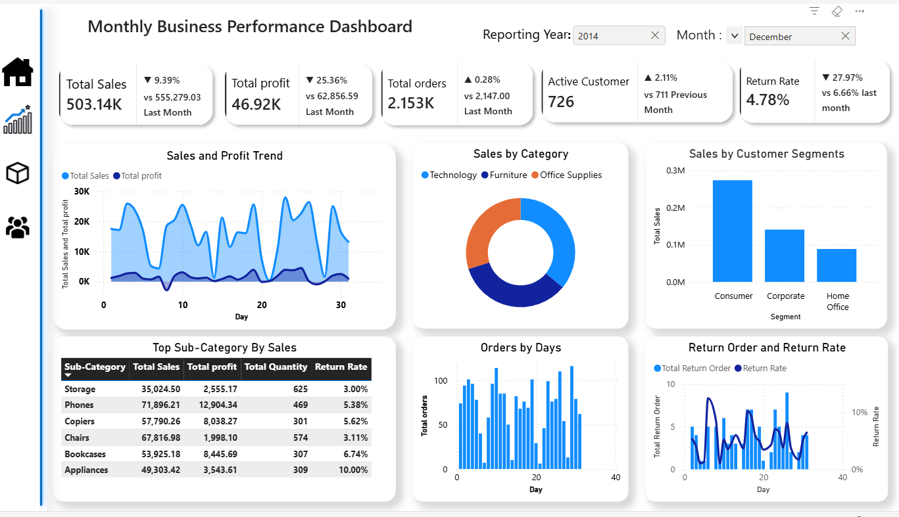

# 📊 Monthly Business Performance Dashboard

A comprehensive **Business Performance Dashboard** built in **Microsoft Power BI** to help organizations monitor sales performance, profitability, customer activity, and return rates through interactive visualizations and KPIs.

---

## 📌 Project Overview

This dashboard provides a complete overview of monthly business performance by combining sales, profit, customer, and operational metrics into a single interactive report.

It enables business users, managers, and decision-makers to quickly identify trends, monitor KPIs, compare performance with previous months, and make data-driven decisions.

---

## 🎯 Objectives

- Monitor overall business performance
- Track monthly sales and profit trends
- Analyze category and customer segment performance
- Identify high-performing product sub-categories
- Monitor customer activity
- Evaluate product return rates
- Support strategic business decisions with interactive analytics

---

## 📈 Dashboard Features
# 📷 Dashboard Preview

### Executive KPI Cards
Displays key business metrics including:

- 💰 Total Sales
- 💵 Total Profit
- 📦 Total Orders
- 👥 Active Customers
- 🔄 Return Rate

Each KPI includes comparison against the previous month with percentage increase/decrease indicators.

---

### Sales & Profit Trend

Visualizes daily sales and profit throughout the selected month to identify:

- Revenue trends
- Profit fluctuations
- Peak sales periods
- Low-performing days

---

### Sales by Category

Interactive donut chart showing contribution from:

- Technology
- Furniture
- Office Supplies

This helps identify which product category contributes the most revenue.

---

### Sales by Customer Segment

Compares sales generated from different customer groups:

- Consumer
- Corporate
- Home Office

Useful for customer segmentation analysis.

---

### Top Sub-Categories

Detailed table displaying:

- Total Sales
- Total Profit
- Quantity Sold
- Return Rate

Allows users to identify the best and worst-performing product sub-categories.

---

### Orders by Day

Daily order volume analysis to identify:

- High demand days
- Low order periods
- Ordering patterns

---

### Return Orders & Return Rate

Tracks:

- Number of returned orders
- Return percentage

Helps monitor product quality and customer satisfaction.

---

## 🎛 Filters

The dashboard includes dynamic filters for:

- Reporting Year
- Month

These slicers automatically update all visuals across the report.

---

# 🛠 Tools & Technologies

- Microsoft Power BI
- Power Query
- DAX (Data Analysis Expressions)
- Data Modeling
- Interactive Visualizations

---

# 📊 Key Business Metrics

| Metric | Description |
|---------|-------------|
| Total Sales | Overall revenue generated |
| Total Profit | Net business profit |
| Total Orders | Number of customer orders |
| Active Customers | Customers who placed orders |
| Return Rate | Percentage of returned orders |

---

# 📌 Dashboard Insights

The dashboard enables users to:

- Monitor business growth over time
- Compare current month with previous month
- Identify profitable product categories
- Analyze customer purchasing behavior
- Track daily sales performance
- Detect high return-rate products
- Improve operational decision-making

---
---

# 🚀 Skills Demonstrated

This project demonstrates practical experience in:

- Data Cleaning
- Data Transformation
- Data Modeling
- DAX Calculations
- KPI Design
- Business Intelligence
- Dashboard Design
- Interactive Reporting
- Data Visualization
- Business Analytics

---

# 💼 Business Use Cases

Suitable for:

- Sales Management
- Executive Reporting
- Business Performance Monitoring
- Customer Analytics
- Product Performance Analysis
- Retail Analytics
- Operational Reporting

---

# ⭐ Highlights

✔ Interactive dashboard

✔ Executive KPI overview

✔ Dynamic Year & Month filtering

✔ Sales trend analysis

✔ Customer segmentation

✔ Category performance

✔ Return rate monitoring

✔ Clean and professional UI

---

# 📬 Contact

**Anish Tiwari**

- GitHub: https://github.com/anish00ti
  

---

## ⭐ If you found this project useful, consider giving it a Star on GitHub!
